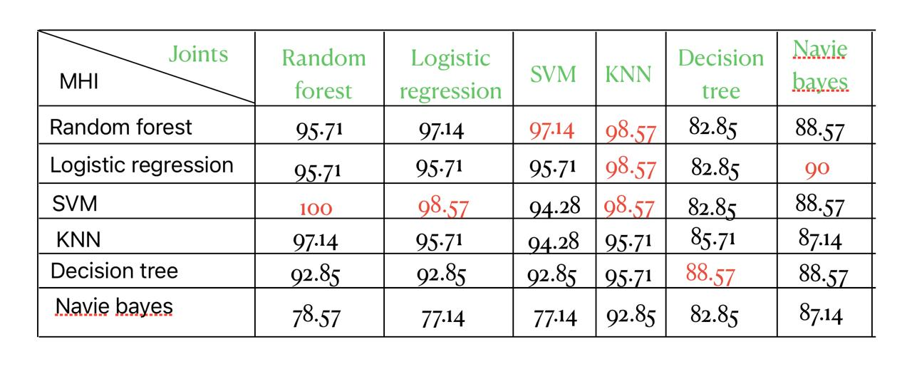

# Fall Detection using Joint Movement and Motion History Images (MHI)

This project detects human falls by analyzing video data using a two-stream approach:

- **Joint Extraction via MoveNet**
- **Motion History Image (MHI) processing**

Both streams are trained with machine learning models, and their predictions are combined to improve final fall detection accuracy.

---

## 🚀 Workflow

### Step 1: Video Preprocessing
- **Input:** Raw videos  
- **Output:** Extracted frames

### Stream 1: Joint Movement Analysis (MoveNet)
- Load MoveNet model.
- Find the minimum number of frames across videos.
- Standardize the frame count via slicing.
- Run MoveNet on each frame to extract joint positions.
- Save joint data as CSV.
- Train ML model on joint data.
- Save trained joint-based model.

### Stream 2: Motion History Images (MHI)
- Generate MHI from frame differences.
- Extract relevant features from MHI images.
- Save features in CSV format.
- Train ML model using MHI features.
- Save trained MHI-based model.

### Final Prediction Phase
- Load both trained models (Joints and MHI).
- Predict class probabilities from both.
- Fuse (multiply) the probabilities.
- Compute and report final accuracy.

---

## 🛠️ Technologies Used
- Python
- TensorFlow Lite (MoveNet)
- OpenCV
- Scikit-learn 
- Pandas, NumPy

## 📈 Results

Here are the model accuracy results:

